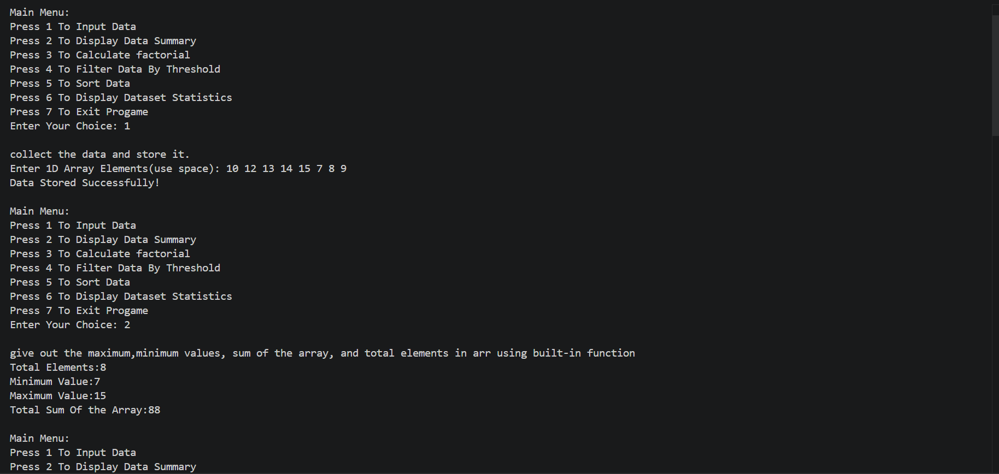

<div align="center">

# -- ! Data Analyzer & Transformer Program ! --
### *Interactive Console-Based Array Manipulation, Factorial Calculation & Dataset Statistics*


</div>

---

# 📋 Table of Contents

- Overview
- Features
- Project Structure
- Workflow
- Functions
- Output Screenshots
- Technologies Used
- Author

---

# 📌 Overview

The **Data Analyzer & Transformer Program** is a menu-driven Python application that allows users to:

- Store a 1D dataset
- Display dataset summaries
- Calculate factorials using recursion
- Filter data using threshold values
- Sort data in ascending or descending order
- Generate dataset statistics manually

The project demonstrates the practical use of:

- Functions
- Lists
- Recursion
- Lambda Functions
- Filter Function
- Match-Case Statements
- Statistics Module

---

# ✨ Features

## 1. Data Collection
Accepts space-separated integers and stores them inside a list.

## 2. Data Summary
Displays:

- Total Elements
- Minimum Value
- Maximum Value
- Total Sum

## 3. Factorial Calculator
Uses recursion to calculate factorials.

## 4. Threshold Filtering
Filters all values greater than or equal to a user-defined threshold.

## 5. Data Sorting
Supports:

- Ascending Order
- Descending Order

## 6. Dataset Statistics
Manually calculates:

- Minimum Value
- Maximum Value
- Sum
- Average

---

# 🏗️ Project Structure

```text
PR-4/
│
├── PR-4.py
├── README.md
├── PR-4.png
├── PR-4.1(1).png
├── PR-4.2(1).png
└── PR-4.3(1).png
```

---

# 🔄 Program Workflow

```text
Start Program
      │
      ▼
Display Main Menu
      │
      ▼
Select Option (1-7)
      │
      ├── 1 → Input Data
      ├── 2 → Data Summary
      ├── 3 → Factorial
      ├── 4 → Threshold Filter
      ├── 5 → Sorting
      ├── 6 → Dataset Statistics
      └── 7 → Exit
```

---

# 🔢 Functions

## Data Collector

```python
data=list(map(int,input("Enter 1D Array Elements(use space): ").split()))
```

Stores user input into a list.

---

## Factorial Function

```python
def factorial(num):
    if num==0 or num==1:
        return 1
    return num*factorial(num-1)
```

Calculates factorial recursively.

---

## Threshold Filtering

```python
filterfunc=lambda val: val >= threshold
filtered_result=list(filter(filterfunc,arr))
```

Filters values greater than or equal to the threshold.

---

## Sorting

```python
arr.sort()
arr.sort(reverse=True)
```

Sorts data in ascending or descending order.

---

## Dataset Statistics

```python
average=statistics.mean(arr)
```

Calculates average using the statistics module.

---

# 📸 Output Screenshots

## 1. Data Input & Data Summary

```text
Input Data → Option 1
Display Summary → Option 2
```



---

## 2. Factorial Calculation & Threshold Filter

```text
Factorial → Option 3
Threshold Filter → Option 4
```

.png)

---

## 3. Sorting Data

```text
Ascending and Descending Order
```

.png)

---

## 4. Dataset Statistics & Exit Program

```text
Statistics → Option 6
Exit → Option 7
```

.png)

---

# 🛠️ Technologies Used

| Technology | Purpose |
|------------|---------|
| Python | Core Programming Language |
| Statistics Module | Average Calculation |
| Lambda Function | Threshold Filtering |
| Filter Function | Data Selection |
| Match-Case | Menu Handling |
| Recursion | Factorial Calculation |

---

# 🎯 Sample Output

```text
Dataset Statistics:

Minimum value: 7
Maximum value: 15
Sum of all values: 88
Average value: 11
```

---

# 👨‍💻 Author

**Tejas Verma**

Python Programming Project – PR-4

---

# 📄 License

This project is created for educational purposes.
