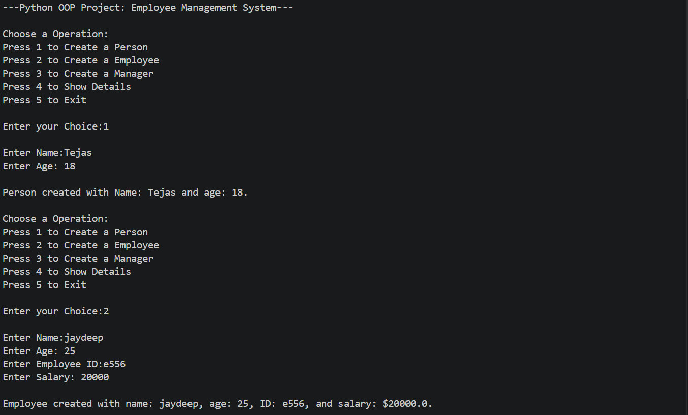

<div align="center">

# -- ! Employee Management System ! --
### *Interactive Console-Based OOP Project in Python*

[](https://www.python.org/)
[](https://www.python.org/)
[](https://www.python.org/)
[](https://www.python.org/)

<br/>

> *"Object-Oriented Programming turns real-world concepts into reusable, elegant code."*

</div>

---

## 📋 Table of Contents

- [📌 Overview](#-overview)
- [🎯 Problem Statement](#-problem-statement)
- [✨ Key Features](#-key-features)
- [🏗️ Project Structure](#️-project-structure)
- [🔄 Project Workflow](#-project-workflow)
- [🧱 Class Architecture](#-class-architecture)
- [🔐 Encapsulation](#-encapsulation)
- [🧬 Inheritance & Method Overriding](#-inheritance--method-overriding)
- [🖥️ Menu & UI](#️-menu--ui)
- [📸 Screenshots](#-screenshots)
- [🛠️ Tech Stack](#️-tech-stack)
- [📈 Results & Insights](#-results--insights)
- [🏆 Advantages](#-advantages)
- [📄 License](#-license)
- [👤 Author](#-author)
- [🙏 Acknowledgements](#-acknowledgements)

---

## 📌 Overview

The **Employee Management System** is an interactive, console-based Python application that demonstrates core **Object-Oriented Programming (OOP)** concepts such as classes, inheritance, encapsulation, method overriding, constructors, destructors, `super()`, and `issubclass()`. The program presents a clean menu-driven interface that runs continuously until the user chooses to exit.

This project is designed to:
- Strengthen understanding of class hierarchies and inheritance chains
- Practice encapsulation using private attributes with getter/setter methods
- Apply method overriding to customize behavior across derived classes
- Build a real-world model of employee roles (Person → Employee → Manager)

---

## 🎯 Problem Statement

> **Objective:** Build a console-based Employee Management System that utilizes OOP concepts to model employee data and operations.

You are building a management system for a company. The program must accept user choices from a menu and execute the corresponding task — creating persons, employees, or managers, and displaying their stored details.

| 📂 Feature | 📄 Type | 🔍 Description |
|------------|---------|----------------|
| Person Class | Base Class | Stores name and age; base for all entities |
| Employee Class | Derived Class | Inherits Person; adds employee_id and salary with encapsulation |
| Manager Class | Derived Class | Inherits Employee; adds department attribute |
| Show Details | Display | Shows stored details of any created object |
| Menu-Driven UI | Console CLI | Continuously running menu with 5 options |

The goal is to demonstrate **fundamental Python OOP skills** through a clean, real-world interactive program.

---

## ✨ Key Features

| Feature | Description |
|--------|-------------|
| 🔁 **Infinite Menu Loop** | Program runs continuously until user selects Exit |
| 🧱 **3 Layered Classes** | Person → Employee → Manager using single inheritance |
| 🔐 **Encapsulation** | `salary` and `employee_id` are private; accessed via getters/setters |
| 🔃 **Method Overriding** | `display()` is overridden in each class to show role-specific info |
| 🧬 **Inheritance via `super()`** | Each derived class calls the parent `__init__` using `super()` |
| 🗑️ **Destructor** | `__del__` defined in each class; called on exit to free resources |
| 🖥️ **CLI Interface** | Simple, clean text-based menu for user interaction |
| ✅ **Input-Driven Flow** | Fully driven by user input with Python `match-case` branching |
| ⚠️ **Invalid Input Handling** | Detects and reports invalid menu or sub-menu choices |
| 📦 **Object Storage** | All created objects are stored in a dictionary for later display |

---

## 🏗️ Project Structure

```
📦 employee-management-system/
│
├── 📄 PR-5.py          ← Main Python script (entry point)
│
└── 📄 README.md        ← Project documentation
```

---

## 🔄 Project Workflow

```
Program Start
      │
      ▼
┌─────────────────────────────────┐
│   Display Main Menu             │  ← Options: 1-5
└───────────────┬─────────────────┘
                │
   ┌────────────┼────────────┐
   ▼            ▼            ▼
┌──────┐    ┌──────┐    ┌──────────┐
│  1   │    │  2   │    │    3     │
│Person│    │Empl. │    │ Manager  │
└──┬───┘    └──┬───┘    └────┬─────┘
   │           │             │
   ▼           ▼             ▼
┌────────────────────────────────────┐
│  Create Object → Store in Dict     │
└──────────────────┬─────────────────┘
                   │
            ┌──────┴──────┐
            ▼             ▼
        Choice: 4     Choice: 5
       Show Details     Exit
            │             │
            ▼             ▼
     Sub-menu: Pick   Clear all objects
     Person/Emp/Mgr   Print goodbye msg
            │
            ▼
     Call obj.display()
            │
      Loop Back to Menu
```

---

## 🧱 Class Architecture

### 1. `person` — Base Class

The foundation of all entities in the system.

```python
class person:
    def __init__(self, name, age):
        self.name = name
        self.age = age

    def display(self):
        print("Person Details:")
        print(f"  Name : {self.name}")
        print(f"  Age  : {self.age}")

    def __del__(self):
        pass
```

| Attribute | Type | Access |
|-----------|------|--------|
| `name` | `str` | Public |
| `age` | `int` | Public |

---

### 2. `employee` — Derived from `person`

Extends `person` with employee-specific attributes; demonstrates **encapsulation**.

```python
class employee(person):
    def __init__(self, name, age, employee_id, salary):
        super().__init__(name, age)
        self.set_employee_id(employee_id)
        self.set_salary(salary)
```

| Attribute | Type | Access | Method |
|-----------|------|--------|--------|
| `name` | `str` | Public (inherited) | — |
| `age` | `int` | Public (inherited) | — |
| `__employee_id` | `str` | **Private** | `get_employee_id()` / `set_employee_id()` |
| `__salary` | `float` | **Private** | `get_salary()` / `set_salary()` |

---

### 3. `manager` — Derived from `employee`

Extends `employee` with a `department` attribute and overrides `display()`.

```python
class manager(employee):
    def __init__(self, name, age, employee_id, salary, department):
        super().__init__(name, age, employee_id, salary)
        self.__department = department
```

| Attribute | Type | Access | Method |
|-----------|------|--------|--------|
| All employee attributes | — | Inherited | — |
| `__department` | `str` | **Private** | `get_department()` |

---

## 🔐 Encapsulation

Sensitive data (`salary` and `employee_id`) are stored as **private attributes** using Python's name-mangling (`__` prefix). They are accessed and modified only through getter and setter methods.

```python
# Getter
def get_salary(self):
    return self.__salary

# Setter with validation
def set_salary(self, salary):
    if salary < 0:
        print("Salary cannot be Negative!!!")
        self.__salary = 0.0
        return
    self.__salary = salary
```

**Why encapsulation matters:**

| Benefit | Detail |
|---------|--------|
| 🔒 **Data Protection** | Prevents direct modification of sensitive fields |
| ✅ **Validation** | Setters can enforce rules (e.g., no negative salary) |
| 🔧 **Maintainability** | Internal representation can change without breaking external code |
| 🧹 **Clean Interface** | Users interact through well-defined methods only |

---

## 🧬 Inheritance & Method Overriding

The system uses **single inheritance** in a linear chain:

```
person
  └── employee
        └── manager
```

`super()` is used in every derived class to call the parent constructor:

```python
# employee calls person's __init__
super().__init__(name, age)

# manager calls employee's __init__
super().__init__(name, age, employee_id, salary)
```

`display()` is **overridden** in both `employee` and `manager` to show role-appropriate information:

```python
# manager's display() shows department too
def display(self):
    print(f"Manager Details:")
    print(f"  Name        : {self.name}")
    print(f"  Age         : {self.age}")
    print(f"  Employee ID : {self.get_employee_id()}")
    print(f"  Salary      : ${self.get_salary():.1f}")
    print(f"  Department  : {self.__department}")
```

---

## 🖥️ Menu & UI

The program runs a `while True` loop with a `match-case` statement for clean branching:

```python
match choice:
    case 1: # Create Person
    case 2: # Create Employee
    case 3: # Create Manager
    case 4: # Show Details
    case 5: # Exit
    case _: # Invalid
```

**Main Menu:**
```
---Python OOP Project: Employee Management System---

Choose a Operation:
Press 1 to Create a Person
Press 2 to Create a Employee
Press 3 to Create a Manager
Press 4 to Show Details
Press 5 to Exit
```

**Sub-menu (Show Details):**
```
Choose details to Show:
Press 1 to Show Person.
Press 2 to Show Employee.
Press 3 to Show Manager.
```

---

## 📸 Screenshots

### 🟢 Program Start — Creating a Person & Employee



---

### 🟡 Creating a Manager


---

### 🔵 Show Details — Person


---

### 🟣 Show Details — Employee & Manager


---

### 🔴 Exiting the System


---

## 🛠️ Tech Stack

| Tool | Version | Purpose |
|------|---------|---------|
| 🐍 **Python** | 3.10+ | Core programming language |
| 🧱 **Classes** | Built-in | OOP structure via `class` keyword |
| 🧬 **Inheritance** | Built-in | `super()` for parent class access |
| 🔐 **Encapsulation** | Built-in | Name-mangling (`__`) for private attrs |
| 🔃 **Method Overriding** | Built-in | Overriding `display()` in sub-classes |
| 🗑️ **Destructor** | Built-in | `__del__` for resource cleanup |
| 🔀 **Match-Case** | Python 3.10+ | Clean branching for menu choices |
| 🖨️ **print() / input()** | Built-in | Console I/O and user interaction |
| 📐 **f-strings** | Python 3.6+ | Formatted string output |

---

## 📈 Results & Insights

After running the program, the following outputs are produced:

- ✅ **3 Distinct Object Types** — Person, Employee, and Manager can each be created
- 🔐 **Encapsulated Data** — Salary and Employee ID are protected via getters/setters
- 🔃 **Overridden Display** — Each class prints role-specific details via its own `display()`
- 📦 **Object Persistence** — All objects are stored in a dict and displayed on demand
- 🔁 **Persistent Menu** — Program loops back after every task until manually exited
- 🗑️ **Clean Exit** — All stored objects are cleared on exit, triggering `__del__`
- ⚠️ **Error Feedback** — Invalid choices trigger a clear "Invalid Choice!!!" message

---

## 🏆 Advantages

| Advantage | Detail |
|-----------|--------|
| 🎓 **Beginner Friendly** | Core OOP concepts in one compact, runnable project |
| 🔄 **Extensible** | Easy to add new classes like `Developer`, `Intern`, `HR`, etc. |
| 📚 **Educational** | Reinforces inheritance chains, encapsulation, and polymorphism |
| 🖥️ **No Dependencies** | Runs with pure Python — no external libraries needed |
| ⚡ **Lightweight** | Single-file script, instantly runnable from any terminal |
| 🧪 **Validated Input** | Negative salary is caught and reset to 0 with a message |
| 📖 **Readable Code** | Clean `match-case` structure makes logic easy to follow |
| 🛡️ **Private Data** | Name-mangling prevents accidental attribute access |

---

## 📄 License

This project is licensed under the **MIT License** — see the [LICENSE](LICENSE) file for full details.

```
MIT License — Free to use, modify, and distribute with attribution.
```

---

## 👤 Author

<div align="center">

### Tejas Varma

[](https://github.com/isamaliya16)
[](https://www.linkedin.com/in/ayush-isamaliya-686533312/)

> *"Every class you write is a blueprint — design it well, and the objects take care of themselves."*

**🎓 Role:** Junior Python Developer | OOP Enthusiast \
**📍 Location:** India\
**🛠️ Skills:** Python · OOP · CLI Applications · Encapsulation · Inheritance · Pattern Programming

</div>

---

## 🙏 Acknowledgements

Special thanks to the following resources and communities that made this project possible:

- 📚 [Python Official Docs](https://docs.python.org/3/) — Official Python language reference
- 🧱 [Real Python — OOP](https://realpython.com/python3-object-oriented-programming/) — In-depth OOP tutorials
- 🔐 [GeeksForGeeks — Encapsulation](https://www.geeksforgeeks.org/encapsulation-in-python/) — Encapsulation in Python
- 🧬 [W3Schools — Inheritance](https://www.w3schools.com/python/python_inheritance.asp) — Beginner Python reference
- 📐 [Python f-strings Guide](https://realpython.com/python-f-strings/) — Formatted string literals
- 💬 [Stack Overflow Community](https://stackoverflow.com/) — Problem-solving support
- 📖 [Kaggle Learn](https://www.kaggle.com/learn) — Python and programming courses

---

<div align="center">

---

*Made with ❤️ and ☕ — Last updated: June, 2026*

</div>
