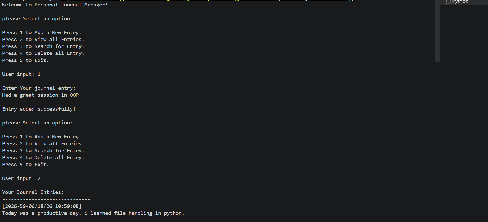

<div align="center">

# -- ! Personal Journal Manager ! --
### *Interactive Console-Based Journal with File Handling & OOP*

[](https://www.python.org/)
[](https://www.python.org/)
[](https://www.python.org/)
[](https://www.python.org/)

<br/>

> *"A journal is your thoughts given a home — and every home deserves a good file system."*

</div>

---

## 📋 Table of Contents

- [📌 Overview](#-overview)
- [🎯 Problem Statement](#-problem-statement)
- [✨ Key Features](#-key-features)
- [🏗️ Project Structure](#️-project-structure)
- [🔄 Project Workflow](#-project-workflow)
- [📂 OOP Structure](#-oop-structure)
- [⚙️ File Handling Modes](#️-file-handling-modes)
- [🛡️ Exception Handling](#️-exception-handling)
- [🖥️ Example Console Interaction](#️-example-console-interaction)
- [🛠️ Tech Stack](#️-tech-stack)
- [📈 Results & Insights](#-results--insights)
- [🏆 Advantages](#-advantages)
- [📄 License](#-license)
- [👤 Author](#-author)
- [🙏 Acknowledgements](#-acknowledgements)

---

## 📌 Overview

The **Personal Journal Manager** is a Python console application that lets users maintain a personal journal using text file handling. Built with **Object-Oriented Programming (OOP)** principles, it provides a clean menu-driven interface for adding, viewing, searching, and deleting journal entries — all while handling errors gracefully.

This project is designed to:
- Demonstrate real-world file handling using Python's built-in `open()` in various modes
- Apply OOP concepts through a `JournalManager` class with instance methods
- Handle exceptions such as `FileNotFoundError` and `PermissionError`
- Build a user-friendly, menu-driven CLI application

---

## 🎯 Problem Statement

> **Objective:** Design and develop a Python program that allows users to maintain a personal journal using text file handling, OOP, and exception handling.

| 📂 Feature | 📄 Type | 🔍 Description |
|------------|---------|----------------|
| Add Entry | File Write (Append) | Writes a timestamped journal entry to `journal.txt` |
| View Entries | File Read | Reads and displays all stored journal entries |
| Search Entry | File Read + Filter | Searches entries by keyword or date |
| Delete Entries | File Delete | Removes `journal.txt` after user confirmation |
| Exit | Program Control | Gracefully exits the application |

---

## ✨ Key Features

| Feature | Description |
|--------|-------------|
| 📖 **Add New Entry** | Appends timestamped entries to `journal.txt`, creating it if it doesn't exist |
| 👁️ **View All Entries** | Displays all journal entries from the file with clear formatting |
| 🔍 **Search for Entry** | Finds matching entries by keyword or date string |
| 🗑️ **Delete All Entries** | Deletes the journal file after yes/no confirmation from the user |
| 🔁 **Infinite Menu Loop** | Program runs continuously until the user selects Exit |
| 🛡️ **Exception Handling** | Handles `FileNotFoundError`, `PermissionError`, and general exceptions |
| 🧱 **OOP Design** | `JournalManager` class encapsulates all logic as instance methods |
| 🕐 **Timestamps** | Every entry is automatically stamped with date and time |
| ⚠️ **Invalid Input Handling** | Catches and reports invalid menu choices clearly |

---

## 🏗️ Project Structure

```
📦 PR-6/
│
├── 📄 PR-6.py          ← Main Python script (entry point)
├── 📄 journal.txt      ← Auto-generated journal storage file
│
└── 📄 README.md        ← Project documentation
```

---

## 🔄 Project Workflow

```
Program Start
      │
      ▼
┌─────────────────────────────┐
│   Display Main Menu         │  ← Options 1–5
└────────────┬────────────────┘
             │
   ┌─────────┼──────────┬──────────┬──────────┐
   ▼         ▼          ▼          ▼          ▼
Choice 1  Choice 2  Choice 3  Choice 4  Choice 5
Add Entry  View All  Search    Delete    Exit ✅
   │         │          │          │
   ▼         ▼          ▼          ▼
Append   Read File  Filter     Confirm
 File    & Display  Entries    & Delete
   │         │          │          │
   └─────────┴──────────┴──────────┘
                    │
             Loop Back to Menu
```

---

## 📂 OOP Structure

The entire application is built inside a `JournalManager` class:

```python
class JournalManager:
    def __init__(self, filename="journal.txt"):
        self.filename = filename

    def add_entry(self, entry):       # Appends entry with timestamp
    def view_entries(self):           # Reads and prints all entries
    def search_entry(self, search):   # Finds entries matching keyword
    def delete_entries(self):         # Deletes journal file after confirmation
```

**Key OOP Concepts Used:**

| Concept | Detail |
|---------|--------|
| 🏛️ Class | `JournalManager` encapsulates all journal operations |
| 🔧 `__init__` | Initializes the filename as an instance attribute |
| 📦 Instance Methods | `add_entry`, `view_entries`, `search_entry`, `delete_entries` |
| 🔗 `self` | Used throughout to access `self.filename` |
| 🧱 Encapsulation | File logic and error handling are contained within the class |

---

## ⚙️ File Handling Modes

| Mode | Used In | Purpose |
|------|---------|---------|
| `"a"` (Append) | `add_entry` | Adds entry to file without overwriting; creates file if not present |
| `"r"` (Read) | `view_entries`, `search_entry` | Opens file for reading existing entries |
| `os.remove()` | `delete_entries` | Deletes the journal file entirely |

**Sample write logic:**
```python
with open(self.filename, "a") as f:
    f.write(f"{time}\n{entry}\n\n")
```

---

## 🛡️ Exception Handling

All methods include proper exception handling to prevent crashes:

| Exception | Scenario | Response |
|-----------|----------|----------|
| `FileNotFoundError` | Viewing/searching when no journal exists | User-friendly message shown |
| `PermissionError` | File locked or no OS-level access | Clear error message displayed |
| `Exception` (general) | Any unexpected error | Error is caught and reported |

```python
try:
    with open(self.filename, "r") as f:
        content = f.read()
except FileNotFoundError:
    print("No Journal Entries found!!")
except PermissionError:
    print("Error: Permission denied.")
except Exception as e:
    print(f"Unexpected Error Occurred: {e}")
```

---

## 🖥️ Example Console Interaction

### Welcome Menu & Add Entry



> User selects option `1`, enters a journal entry, and the program saves it with a timestamp. Selecting `2` displays all stored entries.

---

### Search Entry & Delete All Entries


> User searches by keyword `day` and sees matching entries. Selecting `4` prompts for confirmation before deleting all entries.

---

### After Deletion — View & Invalid Input


> After deletion, viewing entries shows no results. Entering an invalid option like `6` displays an appropriate error message.

---

### Exit


> Selecting option `5` prints a goodbye message and gracefully exits the program.

---

## 🛠️ Tech Stack

| Tool | Version | Purpose |
|------|---------|---------|
| 🐍 **Python** | 3.10+ | Core programming language |
| 📁 **os module** | Built-in | File existence check and deletion |
| 🕐 **datetime module** | Built-in | Generating timestamps for entries |
| 🔁 **While Loop** | Built-in | Infinite menu loop control |
| 🧱 **OOP (Class)** | Built-in | Encapsulation of all journal logic |
| 🛡️ **try/except** | Built-in | Exception handling for file operations |
| 🖨️ **print() / input()** | Built-in | Console I/O and user interaction |
| 🔀 **match/case** | Python 3.10+ | Menu choice branching (structural pattern matching) |

---

## 📈 Results & Insights

After running the program, the following behaviors are demonstrated:

- ✅ **Entry Storage** — Journal entries are saved persistently to `journal.txt` with timestamps
- 👁️ **Entry Display** — All entries are shown in a clean, readable format
- 🔍 **Keyword Search** — Case-insensitive matching finds relevant entries instantly
- 🗑️ **Safe Deletion** — Confirmation prompt prevents accidental data loss
- 🛡️ **Crash Prevention** — All file operations are guarded with exception handling
- ⚠️ **Invalid Input** — Unrecognized menu choices are caught and reported clearly
- 🔁 **Persistent Loop** — Program continues running until the user explicitly exits

---

## 🏆 Advantages

| Advantage | Detail |
|-----------|--------|
| 🎓 **Educational** | Covers file handling, OOP, and exception handling in one project |
| 🧱 **OOP Design** | Clean class-based structure makes the code modular and extensible |
| 🛡️ **Robust** | All file operations are wrapped in exception handlers |
| 📚 **Real-World Use** | Simulates an actual journal/diary management application |
| ⚡ **Lightweight** | Single-file script, no external libraries needed |
| 🔄 **Reusable** | `JournalManager` class can be imported and reused in other projects |
| 📖 **Readable** | Clear method names and structure make logic easy to follow |
| 🖥️ **No Dependencies** | Runs with pure Python — nothing to install |

---

## 📄 License

This project is licensed under the **MIT License** — see the [LICENSE](LICENSE) file for full details.

```
MIT License — Free to use, modify, and distribute with attribution.
```

---

## 👤 Author

<div align="center">

### Tejas Varma

[](https://github.com/Tejas14302)

> *"Every journal entry is a step toward understanding yourself better — code it right, and it lasts forever."*

**🎓 Role:** Python Developer | Programming Enthusiast \
**📍 Location:** India \
**🛠️ Skills:** Python · OOP · File Handling · Exception Handling · CLI Applications

</div>

---

## 🙏 Acknowledgements

Special thanks to the following resources and communities that made this project possible:

- 📚 [Python Official Docs](https://docs.python.org/3/) — Official Python language reference
- 📁 [Real Python — File Handling](https://realpython.com/read-write-files-python/) — In-depth file I/O tutorials
- 🧱 [Real Python — OOP](https://realpython.com/python3-object-oriented-programming/) — Object-Oriented Programming in Python
- 🛡️ [GeeksForGeeks — Exception Handling](https://www.geeksforgeeks.org/python-exception-handling/) — Exception handling examples
- 🖥️ [W3Schools Python](https://www.w3schools.com/python/) — Beginner Python reference
- 💬 [Stack Overflow Community](https://stackoverflow.com/) — Problem-solving support
- 📖 [Kaggle Learn](https://www.kaggle.com/learn) — Python and programming courses

---

<div align="center">

---

*Made with ❤️ and ☕ — Last updated: 18 June, 2026*

</div>
