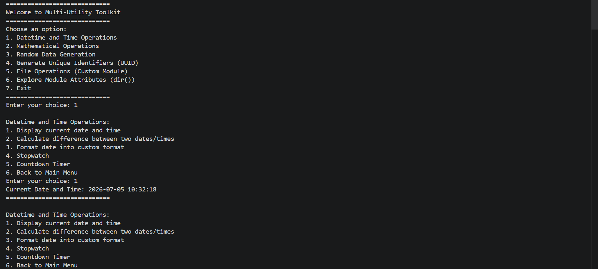
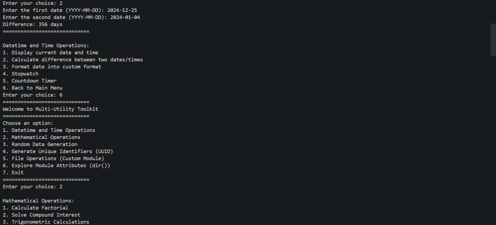
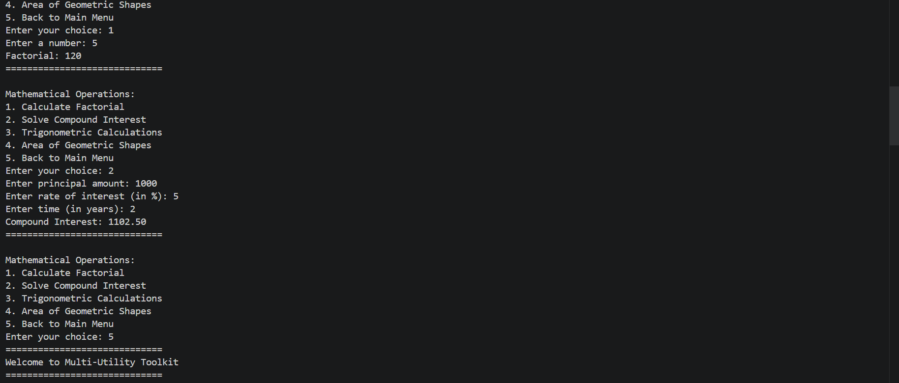
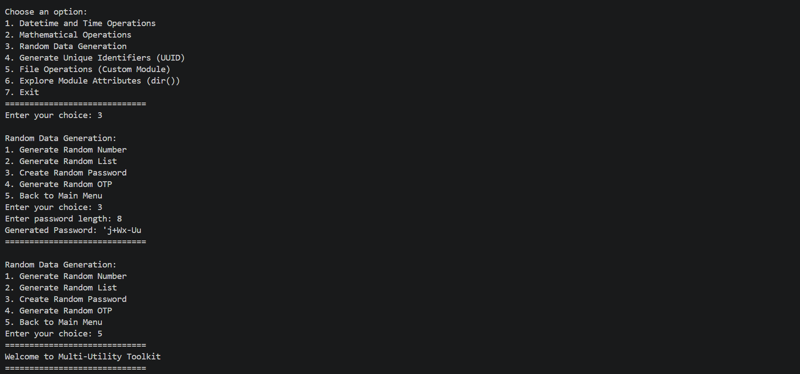
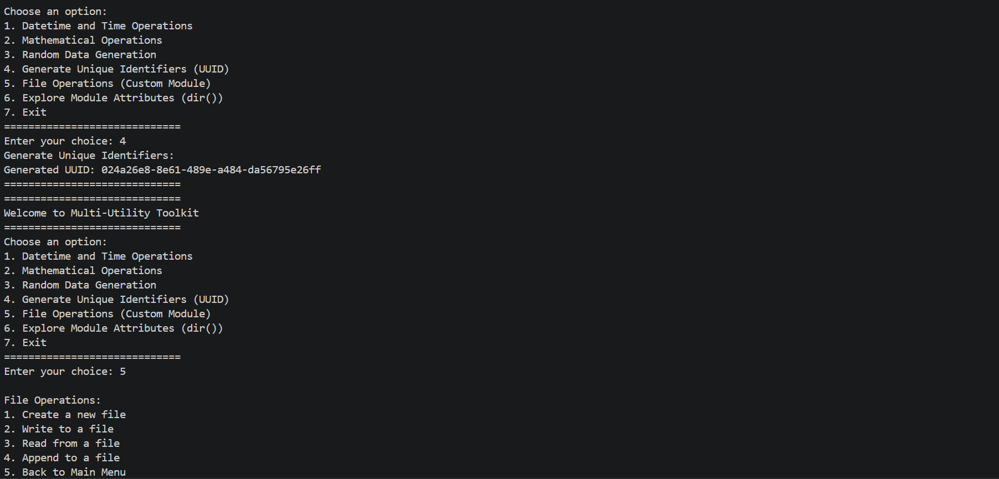
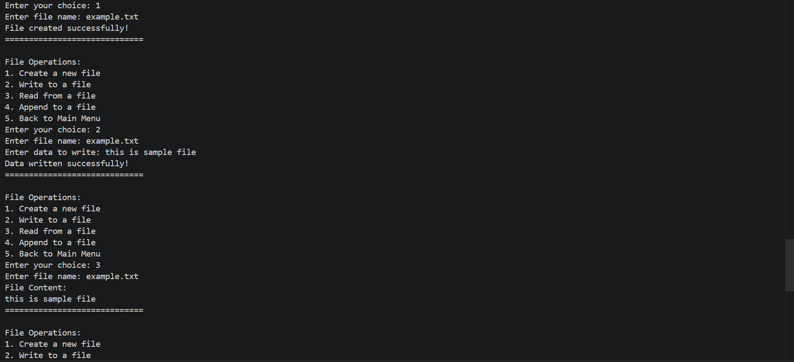
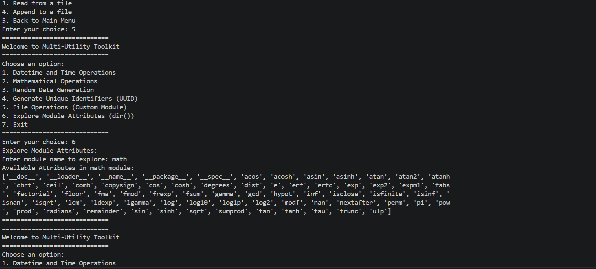
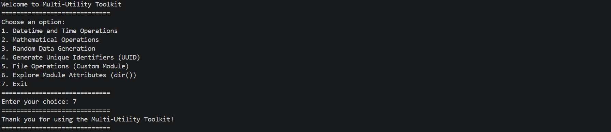

<div align="center">

# -- ! Multi-Utility Toolkit ! --
### *Interactive Console-Based Python Utility Suite*

[](https://www.python.org/)
[](https://www.python.org/)
[](https://www.python.org/)
[](https://www.python.org/)

<br/>

> *"One toolkit, many tools — every module a new way to bend Python to your will."*

</div>

---

## 📋 Table of Contents

- [📌 Overview](#-overview)
- [🎯 Problem Statement](#-problem-statement)
- [✨ Key Features](#-key-features)
- [🏗️ Project Structure](#️-project-structure)
- [🔄 Project Workflow](#-project-workflow)
- [🕒 Module 1 — Datetime & Time Operations](#-module-1--datetime--time-operations)
- [🔢 Module 2 — Mathematical Operations](#-module-2--mathematical-operations)
- [🎲 Module 3 — Random Data Generation](#-module-3--random-data-generation)
- [🆔 Module 4 — Unique Identifiers (UUID)](#-module-4--unique-identifiers-uuid)
- [📁 Module 5 — File Operations](#-module-5--file-operations)
- [🔍 Module 6 — Explore Module Attributes](#-module-6--explore-module-attributes)
- [🖼️ Output Screenshots](#️-output-screenshots)
- [🛠️ Tech Stack](#️-tech-stack)
- [📈 Results & Insights](#-results--insights)
- [🏆 Advantages](#-advantages)
- [📄 License](#-license)
- [👤 Author](#-author)
- [🙏 Acknowledgements](#-acknowledgements)

---

## 📌 Overview

The **Multi-Utility Toolkit** is a menu-driven, interactive Python console application that bundles together several everyday utilities — date/time handling, mathematical calculations, random data generation, unique identifier creation, and file operations — into a single, unified program. It is organized as a proper Python **package**, with each utility living in its own module under the `Modules/` directory and imported cleanly into a central driver script.

This project is designed to:
- Demonstrate how to structure a multi-file Python project using packages and `__init__.py`
- Practice building nested, looping, menu-driven CLI applications
- Apply Python's standard library (`datetime`, `time`, `math`, `random`, `string`, `uuid`) to real utility tasks
- Explore introspection with `dir()` to inspect any importable module at runtime
- Handle files safely with create / write / read / append operations

---

## 🎯 Problem Statement

> **Objective:** Build a single console-based toolkit that consolidates common utility operations behind one main menu, with each category implemented as its own reusable module.

Rather than writing one-off scripts for every small task — checking the date, generating a password, creating a file — this project brings them together under one roof. The user is presented with a main menu and can drill down into sub-menus for each category, perform an operation, and loop back until they choose to exit.

| 📂 Feature | 📄 Type | 🔍 Description |
|------------|---------|----------------|
| Datetime & Time Ops | Module | Current time, date diff, custom formatting, stopwatch, countdown |
| Mathematical Ops | Module | Factorial, compound interest, trigonometry, shape areas |
| Random Data Generation | Module | Random numbers, lists, passwords, OTPs |
| UUID Generator | Module | Generates RFC-4122 unique identifiers |
| File Operations | Module | Create, write, read, and append to files |
| Module Explorer | Utility | Uses `dir()` to inspect any importable module |

The goal is to demonstrate **modular Python program design** through a clean, package-based, menu-driven application.

---

## ✨ Key Features

| Feature | Description |
|--------|-------------|
| 🔁 **Infinite Menu Loop** | Main menu and every sub-menu run continuously until the user backs out or exits |
| 📦 **Custom Package Structure** | All utilities live inside a `Modules` package, imported via `__init__.py` |
| 🕒 **Datetime Suite** | Current date/time, date difference, custom formatting, stopwatch, and countdown timer |
| 🔢 **Math Suite** | Factorial, compound interest, trigonometric functions, and geometric area calculators |
| 🎲 **Random Data Suite** | Random numbers, random lists, secure-style passwords, and 6-digit OTPs |
| 🆔 **UUID Generation** | Instantly generates a version-4 UUID on demand |
| 📁 **File Operations Suite** | Create, write, read, and append text files from the console |
| 🔍 **Runtime Module Explorer** | Dynamically imports any module by name and lists its attributes with `dir()` |
| ✅ **Structural Pattern Matching** | Uses Python's `match-case` statement for clean menu branching |
| ⚠️ **Input & Error Handling** | Catches invalid choices, bad numeric input, and missing files gracefully |

---

## 🏗️ Project Structure

```
📦 PR-7/
│
├── 📄 PR-7.py                     ← Main entry point / main menu driver
│
├── 📦 Modules/                    ← Custom utility package
│   ├── 📄 __init__.py             ← Package exports (file_operations_menu, etc.)
│   ├── 📄 datetime_time_ops.py    ← Datetime & time operations module
│   ├── 📄 math_ops.py             ← Mathematical operations module
│   ├── 📄 random_ops.py           ← Random data generation module
│   ├── 📄 uuid_ops.py             ← UUID generation module
│   └── 📄 file_operations.py      ← File create/write/read/append module
│
└── 📄 README.md                   ← Project documentation
```

---

## 🔄 Project Workflow

```
Program Start
      │
      ▼
┌───────────────────────────────┐
│      Display Main Menu        │  ← 6 utility categories + Exit
└──────────────┬─────────────────┘
               │
   ┌───────────┼──────────────────────────────────────────┐
   ▼           ▼              ▼            ▼              ▼
┌────────┐ ┌────────┐   ┌──────────┐  ┌─────────┐   ┌────────────┐
│Datetime│ │  Math  │   │  Random  │  │  UUID   │   │File Ops /  │
│ Menu   │ │ Menu   │   │  Menu    │  │ Generate│   │dir() Explore│
└───┬────┘ └───┬────┘   └────┬─────┘  └────┬────┘   └─────┬──────┘
    │          │             │             │              │
    ▼          ▼             ▼             ▼              ▼
┌───────────────────────────────────────────────────────────────┐
│              Perform Selected Operation & Print Result         │
└──────────────────────────────┬──────────────────────────────────┘
                               │
                               ▼
                     Loop Back to Respective Menu
                               │
                     (Back to Main Menu selected)
                               │
                               ▼
                     Loop Back to Main Menu
                               │
                        (Choice: 7) Exit ✅
```

---

## 🕒 Module 1 — Datetime & Time Operations

> Handles everything related to dates, formatting, and timing.

**Sub-menu options:**
1. Display current date and time
2. Calculate difference between two dates (in days)
3. Format a date into a custom string format
4. Stopwatch (press Enter to start, Enter again to stop)
5. Countdown timer (in seconds)

**Logic — Date Difference:**
```python
date1 = datetime.datetime.strptime(first, "%Y-%m-%d")
date2 = datetime.datetime.strptime(second, "%Y-%m-%d")
difference = abs((date2 - date1).days)
```

**Sample Output:**
```
Enter the first date (YYYY-MM-DD): 2024-12-25
Enter the second date (YYYY-MM-DD): 2024-01-04
Difference: 356 days
```

---

## 🔢 Module 2 — Mathematical Operations

> Covers factorials, compound interest, trigonometry, and shape areas — all powered by the `math` module.

**Sub-menu options:**
1. Calculate Factorial
2. Solve Compound Interest
3. Trigonometric Calculations (sin, cos, tan)
4. Area of Geometric Shapes (Circle, Square, Rectangle, Triangle)

**Logic — Compound Interest:**
```python
amount = principal * (1 + rate / 100) ** time_years
```

**Sample Output:**
```
Enter principal amount: 1000
Enter rate of interest (in %): 5
Enter time (in years): 2
Compound Interest: 1102.50
```

---

## 🎲 Module 3 — Random Data Generation

> Uses `random` and `string` to generate numbers, lists, passwords, and OTPs.

**Sub-menu options:**
1. Generate Random Number (within a range)
2. Generate Random List (of a given size and range)
3. Create Random Password (letters, digits, punctuation)
4. Generate Random OTP (6-digit numeric code)

**Logic — Password Generation:**
```python
chars = string.ascii_letters + string.digits + string.punctuation
password = "".join(random.choice(chars) for _ in range(length))
```

**Sample Output:**
```
Enter password length: 8
Generated Password: 'j+Wx-Uu
```

---

## 🆔 Module 4 — Unique Identifiers (UUID)

> A one-shot utility that generates a version-4 UUID using Python's built-in `uuid` module.

**Logic:**
```python
print(f"Generated UUID: {uuid.uuid4()}")
```

**Sample Output:**
```
Generate Unique Identifiers:
Generated UUID: 024a26e8-8e61-489e-a484-da56795e26ff
```

---

## 📁 Module 5 — File Operations

> A self-contained file-handling suite built entirely with native `open()` context managers — no external libraries.

**Sub-menu options:**
1. Create a new file
2. Write to a file (overwrite)
3. Read from a file
4. Append to a file

**Logic — Safe Creation:**
```python
try:
    with open(filename, "x"):
        pass
    print("File created successfully!")
except FileExistsError:
    print("File already exists!")
```

**Sample Output:**
```
Enter file name: example.txt
File created successfully!
...
Enter data to write: this is sample file
Data written successfully!
...
File Content:
this is sample file
```

---

## 🔍 Module 6 — Explore Module Attributes

> A runtime introspection tool: type in the name of any importable module and instantly see everything it exposes via `dir()`.

**Logic:**
```python
module = __import__(module_name)
attributes = dir(module)
print(f"Available Attributes in {module_name} module:")
print(attributes)
```

**Sample Output (module = `math`):**
```
Enter module name to explore: math
Available Attributes in math module:
['__doc__', '__loader__', '__name__', '__package__', '__spec__', 'acos', 'acosh', 'asin', ... 'trunc', 'ulp']
```

---

## 🖼️ Output Screenshots

> Real console runs of the toolkit, covering every module from the main menu down to exit.

**Main Menu & Current Date/Time**


**Date Difference & Math Menu**


**Factorial & Compound Interest**


**Random Password Generation**


**UUID Generation & File Operations Menu**


**File Operations — Create, Write & Read**


**Explore Module Attributes (`dir()` on `math`)**


**Exit Screen**


---

## 🛠️ Tech Stack

| Tool | Version | Purpose |
|------|---------|---------|
| 🐍 **Python** | 3.10+ | Core programming language (uses `match-case`) |
| 📦 **Custom Package** | `Modules/` | Encapsulates every utility as its own importable module |
| 🕒 **datetime / time** | Built-in | Date arithmetic, formatting, stopwatch, countdown |
| 🧮 **math** | Built-in | Factorial, trigonometry, geometry, compound interest |
| 🎲 **random / string** | Built-in | Random numbers, lists, passwords, OTPs |
| 🆔 **uuid** | Built-in | Version-4 unique identifier generation |
| 🖨️ **print() / input()** | Built-in | Console I/O and user interaction |
| 📐 **f-strings** | Python 3.6+ | Formatted string output |

---

## 📈 Results & Insights

After running the program, the following outputs are produced:

- ✅ **6 Fully Working Modules** — Datetime, Math, Random, UUID, File Ops, and Module Explorer
- 🔁 **Persistent Nested Menus** — Every sub-menu loops back to itself until "Back to Main Menu" is chosen
- 📁 **Reliable File Handling** — Create, write, read, and append all verified against a real `example.txt`
- 🔍 **Live Introspection** — `dir()` correctly lists attributes for any valid module name (e.g. `math`)
- ⚠️ **Graceful Error Handling** — Invalid menu choices and bad numeric input are caught without crashing

---

## 🏆 Advantages

| Advantage | Detail |
|-----------|--------|
| 📦 **Modular Design** | Each utility is a self-contained module inside a proper Python package |
| 🎓 **Educational** | Demonstrates packages, `__init__.py`, `match-case`, and standard-library usage together |
| 🔄 **Reusability** | Any module (`math_ops`, `random_ops`, etc.) can be imported independently in other projects |
| 🖥️ **No External Dependencies** | Runs with pure Python standard library — nothing to `pip install` |
| ⚡ **Lightweight** | Small footprint, instantly runnable from any terminal |
| 🧪 **Extensible** | New utilities can be added as new modules and registered in `PR-7.py` |
| 🛡️ **Input Safety** | Every module validates user input and handles common exceptions |
| 🔍 **Introspective** | Built-in module explorer doubles as a handy learning tool for Python's ecosystem |

---

## 📄 License

This project is licensed under the **MIT License** — see the [LICENSE](LICENSE) file for full details.

```
MIT License — Free to use, modify, and distribute with attribution.
```

---

## 👤 Author

<div align="center">

### Tejas Varma

[](https://github.com/Tejas14302)

> *"Every utility starts as a single function — just like every toolkit starts as a single script."*

**🎓 Role:** Python Developer | Programming Enthusiast \
**📍 Location:** Surat, India \
**🛠️ Skills:** Python · Packages & Modules · CLI Applications · Logic Building · Standard Library

</div>

---

## 🙏 Acknowledgements

Special thanks to the following resources and communities that made this project possible:

- 📚 [Python Official Docs](https://docs.python.org/3/) — Official Python language reference
- 🕒 [Real Python — datetime](https://realpython.com/python-datetime/) — Working with dates and times
- 🧮 [Python `math` Module Docs](https://docs.python.org/3/library/math.html) — Mathematical functions reference
- 🎲 [Python `random` Module Docs](https://docs.python.org/3/library/random.html) — Random data generation reference
- 🆔 [Python `uuid` Module Docs](https://docs.python.org/3/library/uuid.html) — Unique identifier generation reference
- 🖥️ [W3Schools Python](https://www.w3schools.com/python/) — Beginner Python reference
- 💬 [Stack Overflow Community](https://stackoverflow.com/) — Problem-solving support

---

<div align="center">

---

*Made with ❤️ and ☕ — Last updated: 05 July, 2026*

</div>
