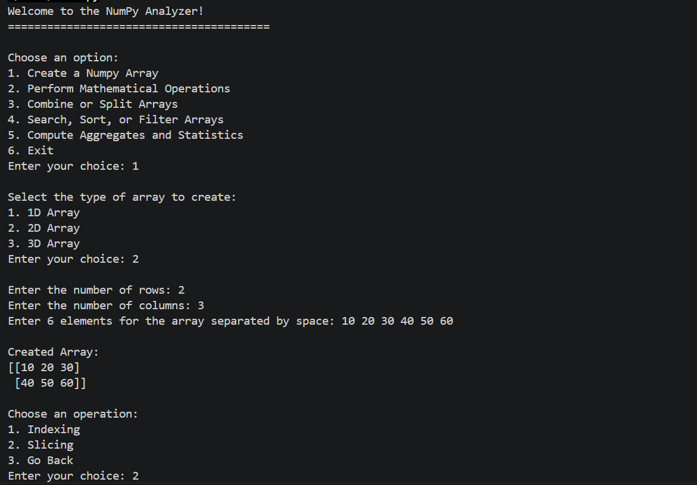
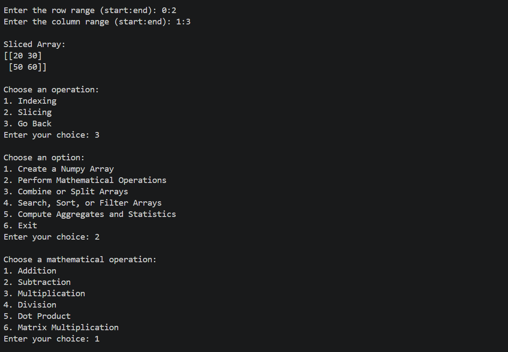
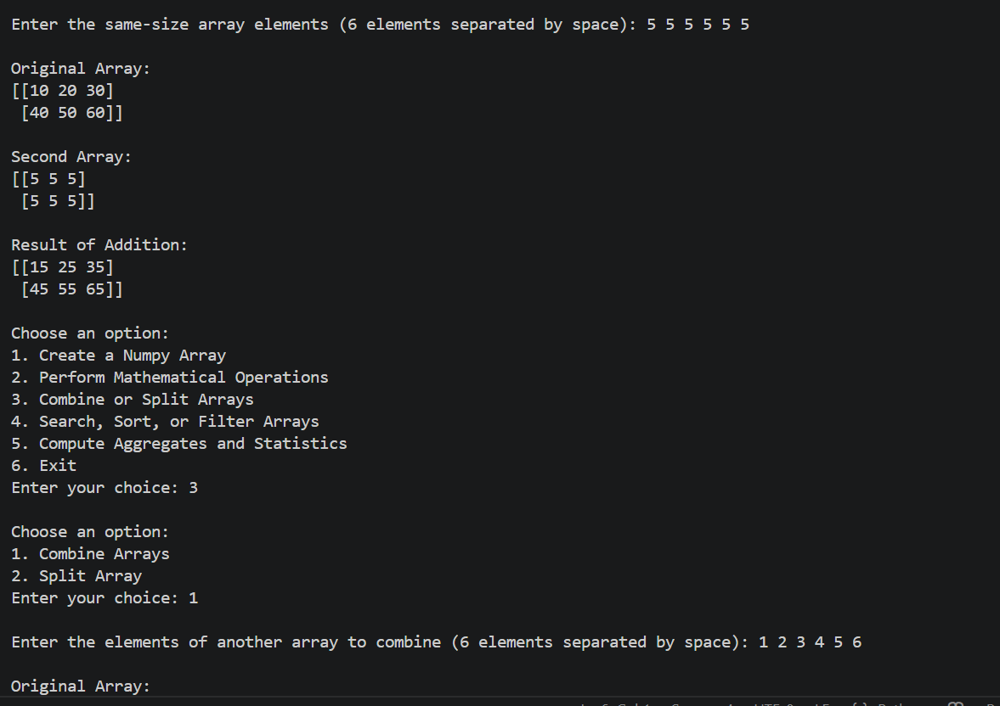
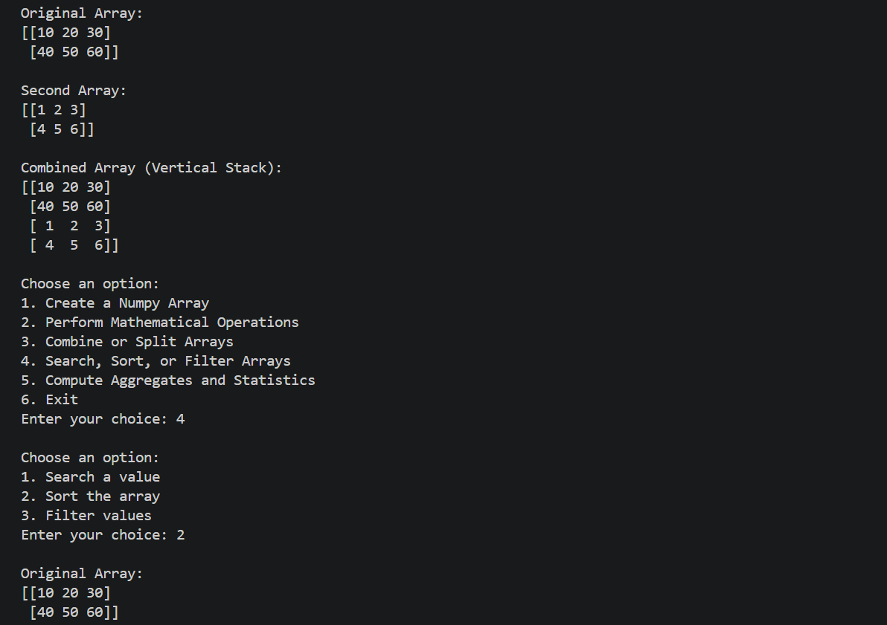
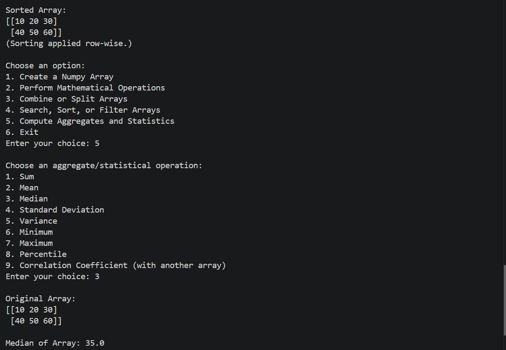
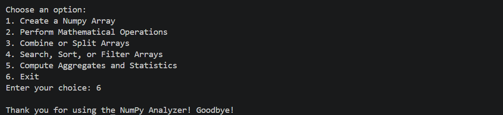

<div align="center">

# -- ! NumPy Analyzer ! --
### *An Interactive Console-Based NumPy Toolkit Built with OOP Principles*

[](https://www.python.org/)
[](https://numpy.org/)
[](https://www.python.org/)
[](https://www.python.org/)

<br/>

> *"An array is just data — until you give it structure, behavior, and a purpose."*

</div>

---

## 📋 Table of Contents

- [📌 Overview](#-overview)
- [🎯 Problem Statement](#-problem-statement)
- [✨ Key Features](#-key-features)
- [🏗️ Project Structure](#️-project-structure)
- [🔄 Project Workflow](#-project-workflow)
- [🧱 Class Design — `DataAnalytics`](#-class-design--dataanalytics)
- [🖥️ Example Console Interaction](#️-example-console-interaction)
- [🛠️ Tech Stack](#️-tech-stack)
- [📈 Results & Insights](#-results--insights)
- [🏆 Advantages](#-advantages)
- [📄 License](#-license)
- [👤 Author](#-author)
- [🙏 Acknowledgements](#-acknowledgements)

---

## 📌 Overview

The **NumPy Analyzer** is an interactive, console-based Python application that combines **NumPy's array-processing power** with **Object-Oriented Programming (OOP)** principles. It's built around a single encapsulated `DataAnalytics` class that lets users create, inspect, and analyze 1D, 2D, and 3D arrays through a clean, menu-driven interface — without writing a single line of code themselves.

This project is designed to:
- Demonstrate how NumPy operations can be wrapped inside a well-structured class
- Practice encapsulation, properties, static methods, and class methods in Python
- Apply `match`/`case` structural pattern matching instead of long `if-elif` chains
- Provide a hands-on, menu-driven tool for array creation, math, search/sort/filter, and statistics

---

## 🎯 Problem Statement

> **Objective:** Develop a NumPy Analyzer that integrates NumPy functionalities and Object-Oriented Programming (OOP) principles. The toolkit allows users to perform common data operations, statistical analyses, and mathematical computations on datasets using NumPy arrays.

| 📂 Feature | 📄 Type | 🔍 Description |
|------------|---------|----------------|
| Array Management | Core | Create, index, slice, combine, and split 1D/2D/3D arrays |
| Mathematical Operations | Core | Element-wise addition, subtraction, multiplication, division, dot product, matrix multiplication |
| Search, Sort & Filter | Core | Search for values, sort row-wise, filter with custom conditions |
| Aggregates & Statistics | Core | Sum, mean, median, std deviation, variance, min/max, percentiles, correlation |
| OOP Design | Structure | Constructors, encapsulation, `@property`, `@staticmethod`, `@classmethod` |

The goal is to demonstrate a **clean, class-based approach to array analytics** through a fully interactive CLI.

---

## ✨ Key Features

| Feature | Description |
|--------|-------------|
| 🔁 **Persistent Menu Loop** | Program runs continuously until the user selects Exit |
| 🧮 **1D / 2D / 3D Array Creation** | Users choose dimensionality, shape, and elements interactively |
| 🎯 **Indexing & Slicing** | Access individual elements or sub-arrays right after creation |
| ➕ **Full Math Suite** | Addition, subtraction, multiplication, division, dot product, matrix multiplication |
| 🔗 **Combine / Split** | Vertically stack two arrays or split one into equal parts |
| 🔍 **Search, Sort, Filter** | Locate values, sort row-wise, filter with conditions like `> 20` |
| 📊 **Aggregates & Statistics** | Sum, mean, median, std deviation, variance, min, max, percentile, correlation |
| 🧱 **True OOP Encapsulation** | Internal `_array` state exposed only via a `@property` |
| 🐍 **Modern `match`/`case` Control Flow** | No `if-elif` chains — every menu uses structural pattern matching |
| ⚠️ **Input Validation** | Invalid choices, shapes, and ranges are caught and reported clearly |

---

## 🏗️ Project Structure

```
📦 numpy-analyzer/
│
├── 📄 PR-8.py               ← Main Python script (entry point)
│
└── 📄 README.md             ← Project documentation
```

---

## 🔄 Project Workflow

```
Program Start
      │
      ▼
┌─────────────────────────────┐
│   Display Main Menu         │  ← Create / Math / Combine / Search / Stats / Exit
└────────────┬────────────────┘
             │
     ┌───────┼────────────┬───────────────┬───────────────┐
     ▼       ▼             ▼               ▼               ▼
┌─────────┐ ┌───────────┐ ┌─────────────┐ ┌─────────────┐ ┌────────────┐
│ Choice1 │ │  Choice2  │ │  Choice3    │ │  Choice4    │ │  Choice5   │
│ Create  │ │   Math    │ │  Combine/   │ │ Search/Sort │ │ Aggregates │
│ Array   │ │   Ops     │ │  Split      │ │ /Filter     │ │ /Stats     │
└────┬────┘ └─────┬─────┘ └──────┬──────┘ └──────┬──────┘ └─────┬──────┘
     │             │              │               │              │
     ▼             ▼              ▼               ▼              ▼
┌─────────────────────────────────────────────────────────────────────┐
│                     Print Output to Console                         │
└────────────────────────────┬──────────────────────────────────────┘
                              │
                              ▼
                      Loop Back to Menu
                              │
                     (Choice: 6) Exit ✅
```

---

## 🧱 Class Design — `DataAnalytics`

The entire toolkit is built around one encapsulated class:

```python
class DataAnalytics:
    def __init__(self, array=None):
        self._array = array

    @property
    def array(self):
        return self._array

    @array.setter
    def array(self, value):
        self._array = value
```

| Concept | Where it's used |
|---------|-----------------|
| 🏗️ **Constructor** | `__init__` initializes the internal array |
| 🔒 **Encapsulation** | `_array` is a "private" attribute, exposed only through a property |
| 🧩 **`@property` / `@setter`** | Controlled read/write access to the array |
| ⚙️ **`@staticmethod`** | `_parse_number` — a pure utility with no dependency on instance/class state |
| 🏛️ **`@classmethod`** | `_read_numbers` and `about()` — operate at the class level |
| 🐍 **`match` / `case`** | Every menu (creation, math, combine/split, search/sort/filter, stats) uses structural pattern matching instead of `if-elif` chains |

---

## 🖥️ Example Console Interaction

**Welcome Screen & Array Creation:**



**Slicing an Array & Choosing a Math Operation:**



**Addition Result & Combining Arrays:**



**Combined Array (Vertical Stack) & Sorting:**



**Aggregates & Statistics — Median Calculation:**



**Exiting the Program:**



---

## 🛠️ Tech Stack

| Tool | Version | Purpose |
|------|---------|---------|
| 🐍 **Python** | 3.10+ | Core programming language (required for `match`/`case`) |
| 🔢 **NumPy** | Latest | Array creation, math, statistics, and manipulation |
| 🐍 **`match` / `case`** | Python 3.10+ | Structural pattern matching for all menu logic |
| 🧱 **OOP** | Built-in | Classes, properties, static & class methods |
| 🖨️ **print() / input()** | Built-in | Console I/O and user interaction |

---

## 📈 Results & Insights

Running the program produces:

- ✅ **Full Array Lifecycle** — create, index, slice, combine, split, and analyze 1D/2D/3D arrays
- 🔢 **Accurate Math Operations** — element-wise arithmetic, dot products, and matrix multiplication verified against expected output
- 📊 **Reliable Statistics** — sum, mean, median, standard deviation, variance, percentiles, and correlation computed correctly
- 🔁 **Persistent Menu** — the program loops back after every task until the user exits
- ⚠️ **Clear Error Feedback** — invalid choices, mismatched shapes, and bad ranges are all caught gracefully

---

## 🏆 Advantages

| Advantage | Detail |
|-----------|--------|
| 🧱 **True OOP Design** | Encapsulation, properties, static & class methods used correctly and meaningfully |
| 🐍 **Modern Python Syntax** | `match`/`case` throughout instead of nested `if-elif` chains |
| 📚 **Educational** | Great reference for combining NumPy with class-based design |
| 🖥️ **No External Dependencies Beyond NumPy** | Lightweight and easy to run anywhere |
| ⚡ **Single-File Script** | Instantly runnable from any terminal |
| 🧪 **Extensible** | Easy to add new operations (e.g., reshape, transpose, broadcasting demos) |
| 🛡️ **Input Safety** | Shape mismatches and invalid menu choices are handled without crashing |

---

## 📄 License

This project is licensed under the **MIT License** — see the [LICENSE](LICENSE) file for full details.

```
MIT License — Free to use, modify, and distribute with attribution.
```

---

## 👤 Author

<div align="center">

### Tejas Varma

[](https://github.com/Tejas14302)

> *"Every array starts with a single element — just like every program starts with a single line."*

**🎓 Role:** Python Developer | Programming Enthusiast \
**📍 Location:** Surat, India \
**🛠️ Skills:** Python · NumPy · Object-Oriented Programming · CLI Applications · Logic Building

</div>

---

## 🙏 Acknowledgements

Special thanks to the following resources and communities that made this project possible:

- 📚 [NumPy Official Documentation](https://numpy.org/doc/stable/) — Official NumPy reference
- 📚 [Python Official Docs](https://docs.python.org/3/) — Official Python language reference
- 🐍 [Python `match` Statement Docs](https://docs.python.org/3/reference/compound_stmts.html#the-match-statement) — Structural pattern matching reference
- 🖥️ [W3Schools Python](https://www.w3schools.com/python/) — Beginner Python reference
- 💬 [Stack Overflow Community](https://stackoverflow.com/) — Problem-solving support

---

<div align="center">

---

*Made with ❤️ and NumPy arrays — Last updated: 14 July, 2026*

</div>
